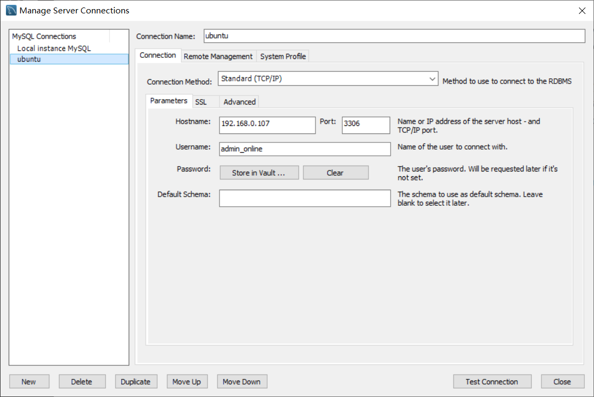
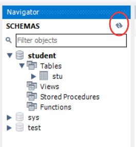
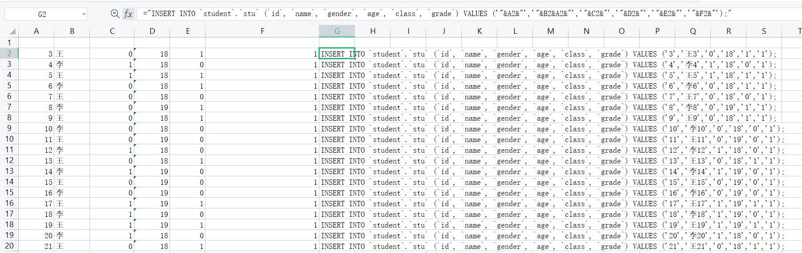

# mysql 手册

***默认环境：Ubuntu(64 - bit)***

*指令中带*‘_’*前缀的词素表示参数

## 一、安装 mysql
终端中输入：
```
#: sudo apt-get install mysql-server
```
*Windows系统下安装 mysql:*

参考https://www.cnblogs.com/wanggang2016/p/10425780.html

Win10环境变量配置：https://blog.csdn.net/yeyueqin/article/details/92801051

注：该链接中的某些cmd指令需要以管理员权限运行。（cmd以管理员身份打开）


## 二、登入mysql
### 1.根用户登入
```
#: sudo mysql -uroot -p
```
### 2.本地本机登入
指令：`mysql -u _username -p _database_name`
-u: == user
-p: == password(带密码登入)

参数名和参数间可以不带空格

示例：

```
#: mysql -u admin -p mysql
Enter password: 123
#: mysql -uadmin -pmysql
```
### 3.线上登入

在WIN10端使用MYSQL Workbench连接到Ubuntu中的数据库.



用于线上登入的用户需要有远程连接的权限。

! 连接前需要修改Ubuntu的Mysql配置文件：

```
root:~# vim /etc/mysql/mysql.conf.d/mysqld.cnf
```

找到

```
bind-address            = 127.0.0.1
```

将这一行加#注释。

## 三、用户管理
***记得使用***`FLUSH PRIVILEGES;`***指令来保存用户信息的修改，以免在mysql服务被关闭后导致用户管理信息丢失***

### 1.新建用户
在mysql内切换至`mysql`库：
```
mysql> use mysql;
```
指令：`CREATE USER '_username'@'_host_ip_address' IDENTIFIED BY '_password';`
示例：

```
mysql> CREATE USER 'dog'@'localhost' IDENTIFIED BY '123456';
mysql> CREATE USER 'pig'@'192.168.1.101_' IDENDIFIED BY '123456';
mysql> CREATE USER 'pig'@'%' IDENTIFIED BY '123456';
mysql> CREATE USER 'pig'@'%' IDENTIFIED BY '';
mysql> CREATE USER 'pig'@'%';
```
注：通配符`%`表示任意地址；密码可以为空。

### 2.权限管理
#### 2.1授权
指令：`GRANT _privileges ON _databasename._tablename TO '_username'@'_host_ip_address';`
示例：
```
mysql> GRANT ALL ON *.* TO 'dog' @ '%';
Query OK, 0 rows affected (0.00sec)

mysql> GRANT SELECT, INSERT ON test.user TO 'pig'@'%';
mysql> GRANT ALL ON *.* TO 'pig'@'%';
mysql> GRANT ALL ON maindataplus.* TO 'pig'@'%';
```
注：用以上命令授权的用户不能给其它用户授权，如果想让该用户可以给其他用户授权，用以下命令:`GRANT _privileges ON _databasename._tablename TO '_username'@'_host_ip_address' WITH GRANT OPTION;`
#### 2.2撤销权限
指令：`REVOKE _privilege ON _databasename._tablename FROM '_username'@'_host_ip_address';`
示例：
```
REVOKE SELECT ON *.* FROM 'pig'@'%';
```
注：假如你在给用户'pig'@'%'授权的时候是这样的（或类似的）：`GRANT SELECT ON test.user TO 'pig'@'%'`，则在使用`REVOKE SELECT ON *.* FROM 'pig'@'%';`命令并不能撤销该用户对test数据库中user表的SELECT 操作。相反，如果授权使用的是`GRANT SELECT ON *.* TO 'pig'@'%';`则`REVOKE SELECT ON test.user FROM 'pig'@'%';`命令也不能撤销该用户对test数据库中user表的Select权限。
## 四、配置 mysql
### 1.初始化配置
终端中输入：
```
#: sudo mysql_secure_installation
```
将对以下内容进行配置：
```
SSWORD PLUGIN can be used to test passwords...
Press y|Y for Yes, any other key for No: N 

#2
Please set the password for root here...
New password: (输入密码)
Re-enter new password: (重复输入)

#3
By default, a MySQL installation has an anonymous user,
allowing anyone to log into MySQL without having to have
a user account created for them...
Remove anonymous users? (Press y|Y for Yes, any other key for No) : N 

#4
Normally, root should only be allowed to connect from
'localhost'. This ensures that someone cannot guess at
the root password from the network...
Disallow root login remotely? (Press y|Y for Yes, any other key for No) : Y 

#5
By default, MySQL comes with a database named 'test' that
anyone can access...
Remove test database and access to it? (Press y|Y for Yes, any other key for No) : N 

#6
Reloading the privilege tables will ensure that all changes
made so far will take effect immediately.
Reload privilege tables now? (Press y|Y for Yes, any other key for No) : Y 
```
### 2.mysql 服务状态
检查 mysql 服务状态：
```
#: systemctl status mysql.service
```
启动 mysql 服务：
```
#: service mysql start
```
关闭 mysql 服务：
```
#: service mysql stop
```
重启 mysql 服务：
```
#: service mysql restart
```


## 五、MYSQL基础操作

### 注：

该部分给出的指令在`MYSQL Workbench(WIN10)`的Query中使用。

在选定当前工作数据库的情况下，可以省略命令中的数据库名参数，且库名、表名的``可以省略。

### 1.SCHEMA 数据库

#### 1.1创建数据库：

````mysql
CREATE SCHEMA `_schemaName` ;
````

### 2.Table 表

#### 2.1创建表

创建表并设置相关列(column)示例（student库下的stu表）：

```mysql
CREATE TABLE `student`.`stu` (
  `id` INT NOT NULL,
  `name` VARCHAR(20) NULL,
  `gender` TINYINT NULL,
  `age` INT NULL,
  `class` INT NULL,
  `grade` INT NULL,
  PRIMARY KEY (`id`));
```

创建表使用UI界面更为方便些。在Workbench左侧的`Navigator`栏中右击数据库的`Tables`一栏，选择菜单栏中的`CREATE TABLE...`一项，在新跳出的页面中完成新页面的相关配置。


#### 2.2列操作 修改表的参数/结构

##### 2.2.1修改字符串编码（比如改为utf8）：

```mysql
ALTER TABLE `_schemaName`.`_tableName`
CHARACTER SET = _Code ;
```

##### 2.2.2添加新的列

```mysql
ALTER TABLE `_schemaName`.`_tableName` ADD `_columnName` params...
```

示例：向stu表中添加户籍地址列

```mysql
ALTER TABLE `stu` ADD `address` VARCHAR(60) NOT NULL DEFAULT '' COMMENT '户籍地址';
```

##### 2.2.3修改列参数

```mysql
ALTER TABLE `_schemaName`.`_tableName` MODIFY `_columnName` _param;
```

示例：修改stu表下adress列字串编码为VARCHAR,长度为70

```mysql
ALTER TABLE `stu` MODIFY `address` VARCHAR(70);
```

##### 2.2.4删除表的列

````mysql
ALTER TABLE `_schemaName`.`_tableName` DROP `_columnName`;
````

示例：删除stu表下的address列

```mysql
ALTER TABLE `stu` DROP `adress`;
```

##### 2.2.5修改表名

````mysql
RENAME TABLE `_schemaName`.`_tableName` TO `_tableName`;
````

示例：修改stu表名为staff

```mysql
RENAME TABLE stu TO stuff;
```

表名修改后需点击左侧Navigator的刷新按钮方能体现结果。



##### 2.2.6 修改列名

注意被修改名称的列要一并给出修改后的列属性。

```mysql
ALTER TABLE `_schemaName`.`_tableName` CHANGE `_oldColumnName` `_newColumnName` _params...;
```

示例：修改stu表下的id列名称为stu_id

```mysql
ALTER TABLE stu CHANGE home address VARCHAR(60) NOT NULL DEFAULT '';
```


#### 2.3查看表

##### 2.3.1查看表数据

```mysql
SELECT _columnName FROM _schemaName._tableName;
```

##### 2.3.2 查看表结构

```mysql
DESC _schemaName._tableName;
```


#### 2.4 行操作

##### 2.4.1插入数据

插入指令中待插入数据的参数与表结构一致。

```mysql
INSERT INTO `_schemaName`.`_tableName`(`columnName`, ...,'Value',...),(...更多的同格式表项);
```

示例：

```mysql
INSERT INTO `student`.`stu` (`id`, `name`, `gender`, `age`, `class`, `grade`) VALUES ('1', '张三', '1', '13', '1', '1');
INSERT INTO `student`.`stu` (`id`, `name`, `gender`, `age`, `class`, `grade`) VALUES ('2', '李四', '0', '13', '2', '1'),('3', '王五', '1', '14', '2', '5');
```

对于大量行连续插入操作，可以通过程序实现。也可以通过Excel帮助。这里先介绍Excel辅助生成数据插入指令：

###### Excel辅助生成多行连续插入指令

以2.1中创建的stu表格式为例，在表格的A2~F2处输入表项格式相对应的参数，在G列用公式生成指令。公式如下：(字符串由双引号包括，并由‘&’与单元格参数连接)

```latex
f="INSERT INTO `student`.`stu` (`id`, `name`, `gender`, `age`, `class`, `grade`) VALUES ('"&A2&"','"&B2&A2&"','"&C2&"','"&D2&"','"&E2&"','"&F2&"');"
```

拖动单元格自动填充即可连续生成连续行数据和输入指令。



##### 2.4.2删除数据

```mysql
DELETE FROM `_schemaName`.`_tableName` WHERE _condition;
```

如果不加条件参数意为删除所有表项。但是清空所有的内容，一般我们用truncate ，能够将id置为零，delete不能将id置零，再插入数据的时候，会按照之前的数据记录的id数继续递增。

示例：从stu表中删除id为21的学生

```mysql
DELETE FROM stu WHERE id=21;
```

